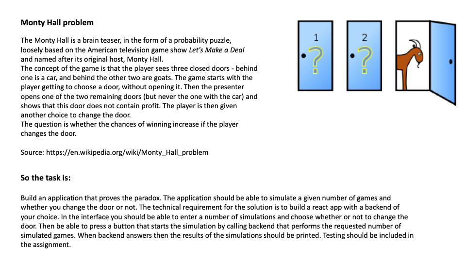

# monty-hall-test

## Instructions
* Implementend with node version `19.5.0`, make sure to be on version that supports `import`
* Start application with `npm run start`

## Extra goals
* Actually be able to play the game in the UI
* Restore the current game round
* See the played history
* All game rules should be handled by the `Game Engine`
* Game must be totally playable via the `Game Engine`, accesible via api

## TODO
* Caching
* Game rules
* Doesn't hide the door with the win through api

## Rules

## Q & A
### Why parcel?
...

### Game engine too complex?
One worry is that the game engine is too complex for this assignment. It is created to make rules completely separate from both client and server. This meant the game cannot be cheated by passing in actions that would allow you to win when you shouldn't have.

In "real life" it is quite common for the game state to be handled by a totally separate game server. By having a separate entity in the form of `Game Engine` it could be easily moved to it's own api.

Also this implementation keeps in mind future games. Which is totally unecessary for this assignment though.