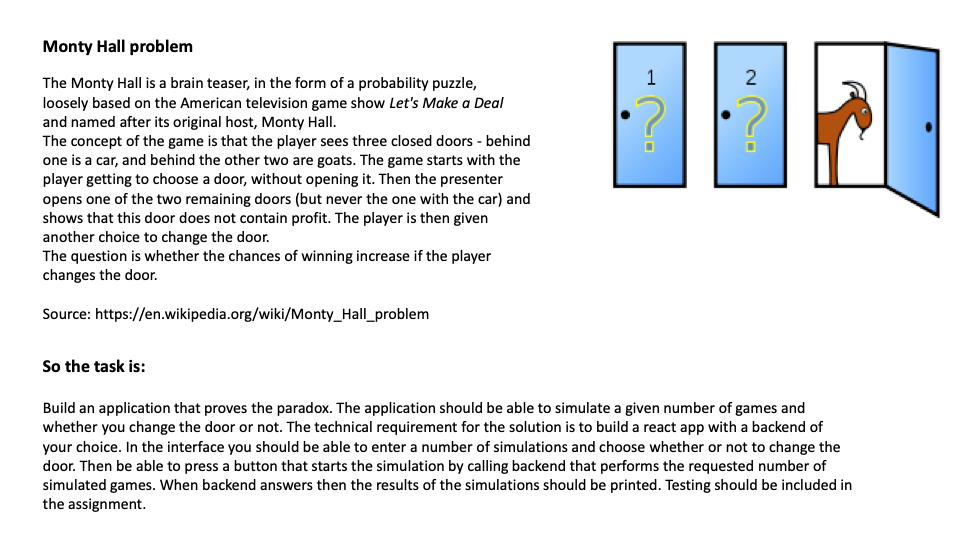

# Monty Hall Problem
## Instructions
* Install packages: `npm install`
* Start application: `npm run start`
    - This command starts both the client and server concurrently
* Run tests: `npm run test`
* Run linting: `npm run lint`

## Code assignment

## Goals
* All game logic should be handled by the `Game Engine`
* Game should be client agnostic, i.e. totally playable without UI logic
* Be able to play the actual game in the UI
* See the player game history

### Future improvements
* The `Game Engine` itself should not be written in `node.js` (server being `node.js` is not an issue). Writing mathematical logic and testing propabilities works a lot better with a language like `C#`
* Maybe the `INACTIVE` state of game round in the `Game ENgine` was an unecessary concept. It introduced a state which only existed when the engine was created. After that it never goes back to `INACTIVE`, since it will go from the latest round with state `COMPLETED` to `ACTIVE`
* Game rules
* More testing
    - UI testing
    - More extensive testing, for example cover helper methods
    - Add more edge cases in game engine logic
* See history for simulations done
* Right now the engine does not consider multiple sessions, users, etc.

### Known bugs
* The game engine returns which door has `Win` before game is completed, basically the door with the win can be known before selecting door if you look in the api response.
* Game history should include all the player choices, for example the selected door, which door was opened, etc.

## Game engine
`Game Engine` is a concept to make rules and game logic completely separate from both client and server. This means the game cannot be cheated since only allowed actions can be passed to change game round state. This also means that playing the game is ui/server code agnostic.

In "real life" it is quite common for the game state to be handled by a totally separate game service. Since `Game Engine` is a separate class it can easily moved and refactored.

### Game Engine rules:
* Current game state can only be edited by the Game Engine internally
    - No public methods to change current game state
    - Engine provides allowed actions to play the game
* Validation will happen on every actions
* Logging is handled internally by the engine